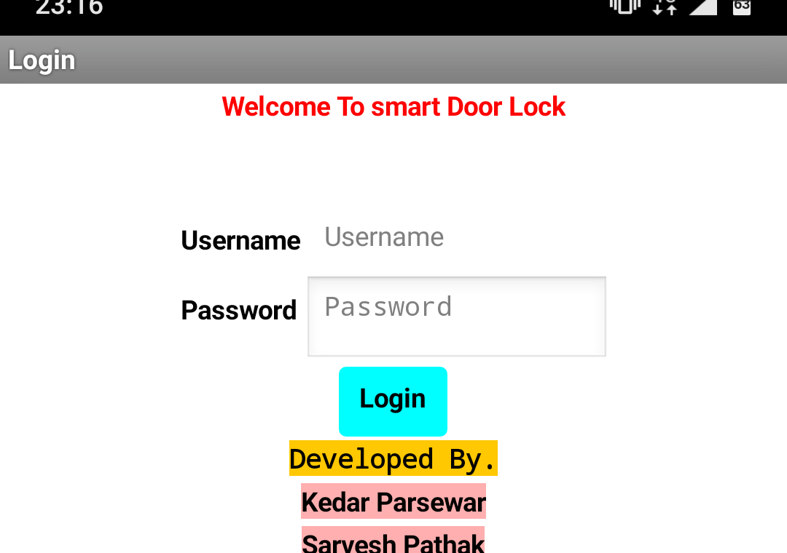
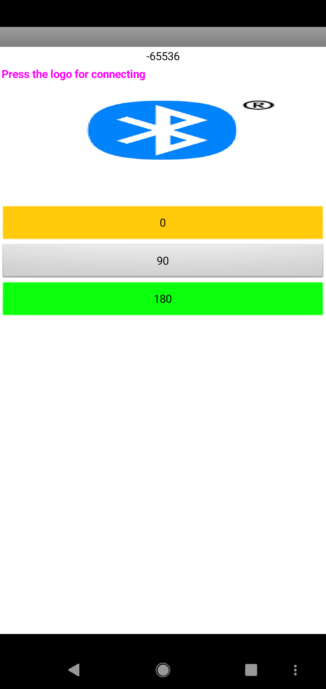

# SmartDoorLock
This system was developed for the small children and old people that something get locked in room or the hotel rooms l.With help of system he is able to <h1>rescue<h1> them easily without  doing any damage to the door.

# Here the screenshots of my application to connect the Bluetooth Arduino uno3.
</img>
  
# After Login He Will Get the Bluetooth Icon on clicking  he has to make connection to the Bluetooth .

</img>
